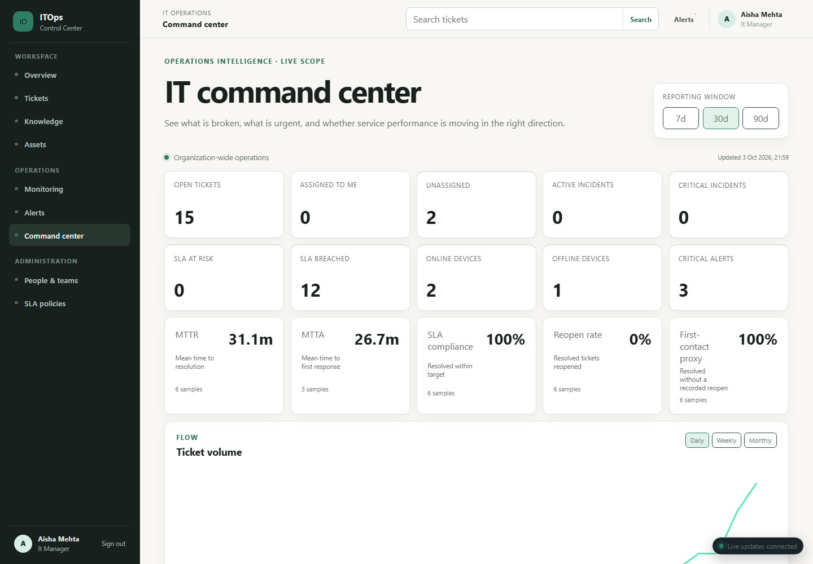
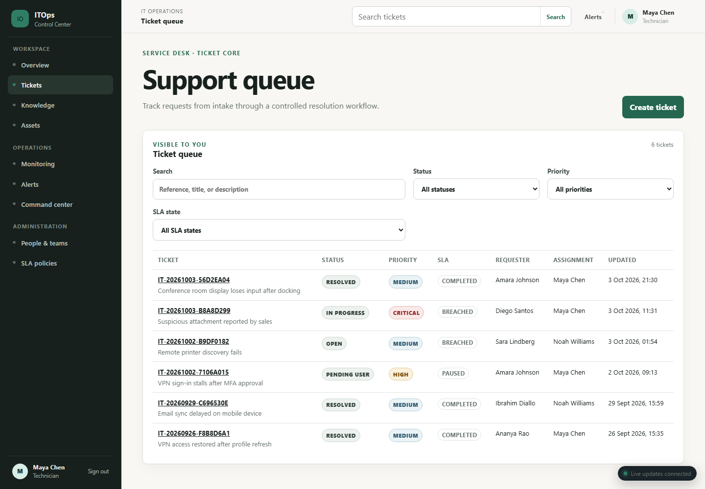
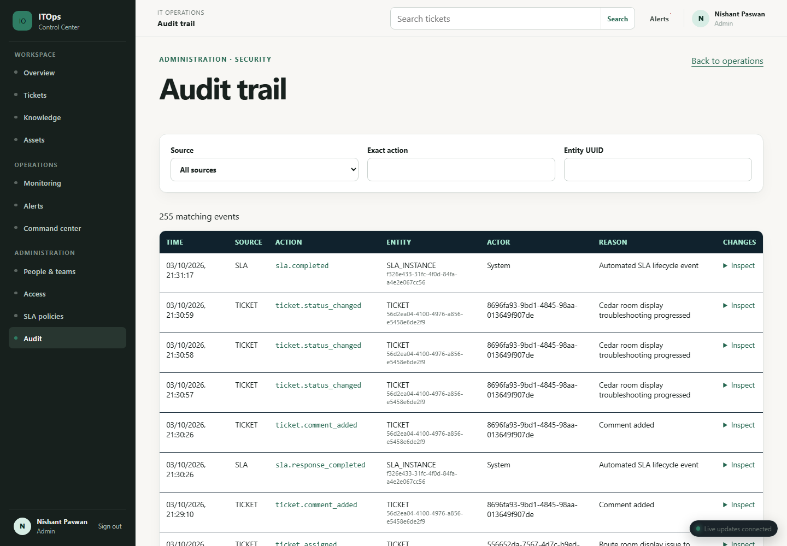

# AI-Powered IT Support & Operations Platform

An enterprise-style IT operations command center connecting employee requests with service-desk work, device health, SLA oversight, and auditable administration. **Portfolio Demo Status: READY WITH LIMITATIONS.** This is a local portfolio demonstration, not a production deployment.

Employees need a clear way to report and track issues; technicians need a scoped queue and trustworthy ticket history; managers need workload and SLA visibility; administrators need controlled access and operational oversight. This project connects those workflows while exercising the authorization boundaries behind them.

## Why this project

A service desk is more than a ticket form: the same request must move safely between people, teams, devices, SLA clocks, and audit history. I built this project to model those boundaries end to end, including what each role can see, which transitions are legal, and how operational signals reach the people responsible for them.

**Engineering highlights:** database-backed sessions and RBAC; SQL-scoped ticket and asset access; transactional ticket/SLA/audit history; PostgreSQL-backed polling workers; authenticated WebSocket update signals; and an advisory AI layer that can fail safely without blocking core support work.

## Product tour

These screenshots are from the running application backed by the fictional Step 6 PostgreSQL demo dataset, not mocked API fixtures. Identities and assets shown are fictional.

The visual story moves from **operational overview → service-desk execution → administrative traceability**.







Follow the [demo runbook](docs/DEMO.md) to explore the same data live.

## Implemented workflows

| Role | Main workflow |
| --- | --- |
| Employee | Sign in, create and follow own tickets, add public comments, read published knowledge, inspect permitted assets. |
| Technician | Work an authorized queue, assign and update tickets, reply publicly or add private notes, inspect history and SLA, use advisory AI/similar-ticket tools. |
| IT Manager | Review workload, operational analytics, SLA activity, tickets, alerts, and trends within granted scope. |
| Admin | Manage directory and role assignments, inspect assets and monitoring, configure supported policies, review alerts and audit history. |

The ticket lifecycle uses the implemented states `NEW`, `OPEN`, `IN_PROGRESS`, `PENDING_USER`, `PENDING_VENDOR`, `ESCALATED`, `RESOLVED`, and `CLOSED`; assignment is a separate operation, not a status. Tickets support priority, category, SLA timers, assignment history, comments, protected attachments, and an event timeline. The application also includes a permission-scoped knowledge base, similar resolved-ticket search, an advisory technician AI abstraction, assets, endpoint telemetry, alerts and rule-based automation, notifications, WebSocket update signals, analytics, and audit/security logging. With the local `disabled` AI provider, guidance is explicitly fallback output; no external model success is claimed.

## Architecture and stack

```text
React + TypeScript SPA (Vite; Nginx in Compose)
  | HTTP + authenticated WebSocket signals
FastAPI routers -> application services -> SQLAlchemy -> PostgreSQL + pgvector
                         |                  ^
                         +-> private files  +-- Python SLA and monitoring polling workers
Optional endpoint agent -> monitoring API
Optional AI provider / ClamAV (not required for local demo)
```

| Area | Technologies verified in this repository |
| --- | --- |
| Backend | Python, FastAPI, Pydantic, SQLAlchemy, Alembic, psycopg, JWT, Argon2 |
| Database | PostgreSQL 17 with pgvector; Alembic migrations |
| Frontend | React, TypeScript, Vite, React Router, TanStack Query, Zod, CSS |
| Operations | Docker Compose, Nginx, Python polling workers, optional Python/psutil endpoint agent |
| Quality | Pytest, Ruff, Mypy, Vitest, Oxlint, Prettier, Playwright, GitHub Actions |

Passwords are verified against Argon2 hashes. Short-lived access tokens stay in browser memory; rotating refresh credentials use an HttpOnly cookie and database-backed sessions. The API checks current permissions and record scope independently of navigation visibility. WebSocket clients authenticate after connection and receive scoped update signals from a transactional outbox; the browser refetches authorized data. SLA and monitoring workers poll PostgreSQL; there is no Redis or Celery dependency. See [architecture](docs/ARCHITECTURE.md), [security](docs/SECURITY.md), and [realtime design](docs/REALTIME.md).

### Decisions and trade-offs

- **PostgreSQL as system of record:** relational constraints and transactions keep assignments, SLA state, and audit events consistent; pgvector supports the optional retrieval path.
- **Server-authoritative access:** database-backed roles and SQL record scopes protect direct API requests, not just visible navigation.
- **Polling workers and WebSockets:** bounded PostgreSQL polling handles current background workloads; WebSockets send scoped change signals, while authorized HTTP reads remain the source of detail. A separate broker is not part of this scope.
- **Optional AI provider:** ticket and knowledge context is minimized and validated before advisory use. The local demo uses labeled fallback behavior; it does not demonstrate external-model quality.
- **Simulated demo telemetry:** fictional device signals make the monitoring workflow reproducible without claiming a real managed fleet.

## Run the local demo

Prerequisites: Docker Engine with Compose v2. For direct development, use Node.js 24/npm 11 and Python 3.12 or 3.13.

1. Copy `.env.example` to an untracked local `.env`. Replace `POSTGRES_PASSWORD`, `ITOPS_JWT_SECRET` (at least 32 random characters), and `ITOPS_INITIAL_ADMIN_PASSWORD` with your own local values. For the optional fictional directory, set `ITOPS_ENTERPRISE_SEED_PASSWORD` to the same local-only bootstrap password. Do not publish these values.
2. Run `docker compose up --build -d`. The API container applies Alembic migrations and base/enterprise seeds before serving requests. Wait for `docker compose ps` to show healthy database, API, and frontend services.
3. For the optional Step 6 workload, run `docker compose exec api python -m scripts.demo_seed` **only on a disposable development database**. It is idempotent for its fictional records and refuses non-development/test environments.
4. Open `http://localhost:5173`. Sign in with a locally seeded account and the password you configured; the role comes from PostgreSQL, never a login selector.

The `.env.example` values are placeholders, not deployable credentials. The demo includes fictional users, tickets, knowledge articles, assets, simulated monitoring devices, and alerts; dashboard values are computed from those records. For role walkthroughs and a safe disposable reset, use [DEMO.md](docs/DEMO.md). For commands, health checks, and direct development, use [SETUP.md](docs/SETUP.md). The production Compose file is a reference topology, **not evidence of production readiness**; see [DEPLOYMENT.md](docs/DEPLOYMENT.md).

For a **2–5 minute walkthrough**: sign in; compare a role-specific overview with the technician queue; open a ticket to show comments, history, assignment and SLA; then view manager analytics and an administrator audit event. End by signing out. The [demo runbook](docs/DEMO.md) supplies the longer live scenario without embedding credentials.

## Verification and limitations

Step 5 verified a clean Docker build, real PostgreSQL migrations, **137/137 PostgreSQL-backed backend tests**, four-role live authentication/RBAC, ticket lifecycle, comments/private notes, attachments, monitoring/alerts, WebSocket delivery, and persistence across `down` → `up`. Step 6 verified the fictional seed and representative role flows on the same real stack. These are historical local results, not claims of a successful public CI run. The [testing guide](docs/TESTING.md) separates automated suites from manual/live verification; rerun the commands there for your environment.

Important boundaries: external AI provider success and production RAG are unverified; local AI uses a labeled fallback. Demo telemetry is simulated, not real fleet monitoring. Production malware scanning, TLS, backup/restore, failover, full penetration testing, formal WCAG certification, and large-scale load/concurrency testing remain unverified. The existing whole-backend Mypy run has seven errors in unrelated files; a remote CI pass has not been observed. No production-readiness or security-certification claim is made.

## Documentation

- [Documentation index](docs/README.md), [setup](docs/SETUP.md), and [demo](docs/DEMO.md)
- [Architecture](docs/ARCHITECTURE.md), [database](docs/DATABASE.md), and [API](docs/API.md)
- [Tickets](docs/TICKETS.md), [SLA](docs/SLA.md), [AI](docs/AI.md), and [monitoring](docs/MONITORING_AGENT.md)
- [Security](docs/SECURITY.md), [RBAC](docs/RBAC.md), [testing](docs/TESTING.md), and [deployment](docs/DEPLOYMENT.md)
- [Portfolio case study and interview notes](docs/PORTFOLIO.md)

`frontend/` contains the SPA, `backend/` the API/migrations/workers/tests, `agent/` the optional endpoint agent, `docs/` the public guides, and `.github/workflows/` the CI/release definitions. Private phase reports, credentials, QA evidence, and database dumps are not part of this repository.
